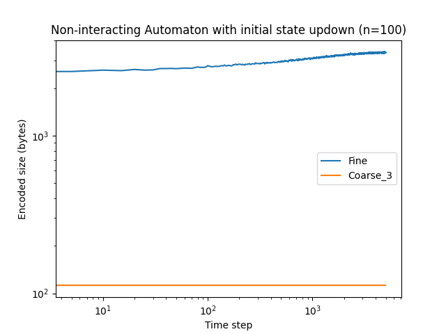
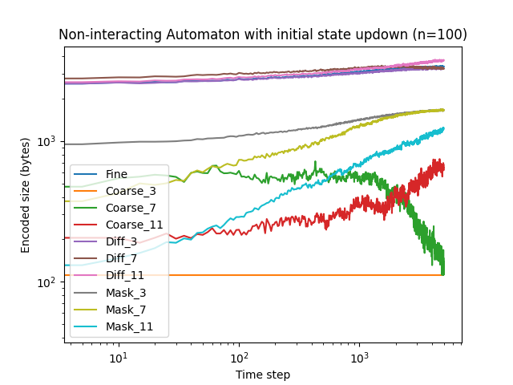

# The Coffee Automaton - Quantifying the Rise and Fall of Complexity in Closed Systems

[](https://www.gnu.org/licenses/)

[](https://github.com/psf/black)
[](https://github.com/charliermarsh/ruff)

A reproduction of the paper [The Coffee Automaton - Quantifying the Rise and Fall of Complexity in Closed Systems](https://arxiv.org/abs/1405.6903).

This codebase started from the given code in the paper and was updated to python 3 with few changes to improve experiment speed. Moreover some additional feature were added such as a fluid-like automaton, different smoothing functions, and different initial states.

## A drop of milk in coffee

|  |  |  |
| :--: | :--: | :--: |
| *Fine* | *Coarse* | *Adjusted coarse* |

## Entropy, Complexity and Sophistication

|  |  |  |
| :--: | :--: | :--: |
| *Fine* | *Coarse* | *Adjusted coarse* |

## Reproduced results

Paper figure:


Reproduced figures:

Note that in our codebase and for the sake of accuracy and generalisation, we replaced "complexity" by the "coarse_3" size and "entropy" by the "fine" size.

| *Interacting* | *Non-Interacting* |
| :--: | :--: |
|  |  |
|  |  |
|  |  |
| Interacting automaton takes more step because we count steps when two identical cells are choosen to be swaped, but results are fairly similar for both complexity and entropy. | Non-interacting automaton results couldn't be reproduced, even in loglog scale we cannot see any sign of complexity increase during the experiment even if the entropy is identical. |


## Added Features

### Circular initial state

Instead of starting with a half coffee / half milk initial state we called **updown**. You can now initialize a circle of milk in the center and coffee all around, called the **circular** initial state.


| *Updown* | *Circular* |
|:--:| :--: |
|  |  |
|  |  |


### Other smoothing functions
 - Generalisation of the coarse-graining function to $k\in N^*, k>2$ categories. In the paper, they take 3 for the initial coarse-graining and 7 for the adujsted coarse-graining.
 - **Diff**erences [0.5 if f(x) == x else x] for each coarse-graining.
 - Differences **Mask** [f(x) == x] for each coarse-graining.


| *Fine* | *Coarse_3* | *Coarse_7* | *Coarse_11* | *Diff_3* | *Diff_7* | *Diff_11* | *Mask_3* | *Mask_7* | *Mask_11* |
| :--: | :--: | :--: | :--: | :--: | :--: | :--: | :--: | :--: | :--: |
|  |  |  |  |  |  |  |  |  |  |

### Fluid automaton

| *Interacting* | *Non-Interacting* | *Fluid* |
| :--: | :--: | :--: |
|  |  |  |


## Installation

### Using pip

```bash
pip install git+https://github.com/MathisFederico/coffeematon.git
```

### From source

```bash
git clone https://github.com/MathisFederico/coffeematon.git
```

Then inside the worspace:
```bash
pip install -e .
```

## Quickstart

Launch an experiment
```bash
python -m coffeematon --help
```

Plot a graph from a csv results file
```bash
python -m coffeematon.plot_results --help
```

Generate a gif from bitmaps
```bash
python -m coffeematon.generate_gifs --help
```


## Results

| Initial state | Automaton type | Size | Graph |
|---------------|----------------|------|-------|
| Updown | Interacting | 100 |  |
| Updown | Interacting | 200 |  |
| Circular | Interacting | 100 |  |
| Circular | Interacting | 200 |  |
| Updown | Fluid | 100 |  |
| Updown | Fluid | 200 |  |
| Circular | Fluid | 100 |  |
| Circular | Fluid | 200 |  |
| Updown | Non-Interacting | 100 |  |
| Updown | Non-Interacting | 200 |  |
| Circular | Non-Interacting | 100 |  |
| Circular | Non-Interacting | 200 |  |

